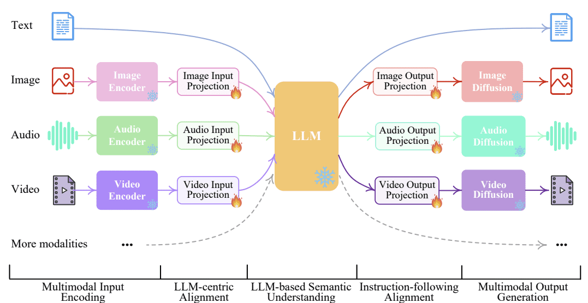
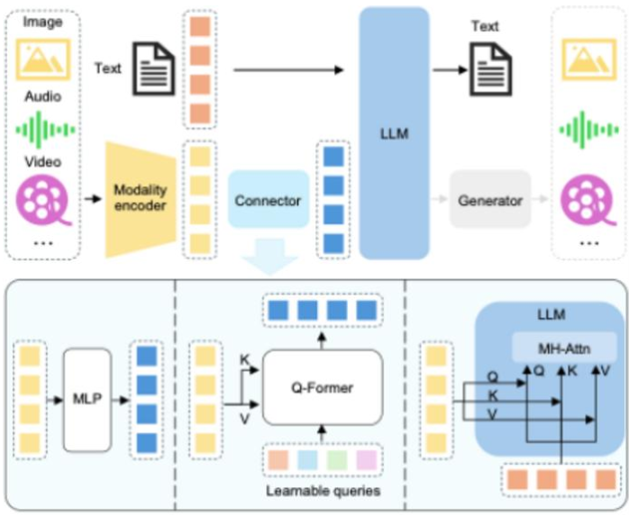

# Multimodalidad en Modelos de Lenguaje Grandes: Estado del Arte (Febrero 2025)

*Author*: **[Pedro Ismael Ruiz](https://www.linkedin.com/in/pdro-ruiz/)**

*Date*: 03 de marzo de 2025

## 1. Introducción

La **multimodalidad** en modelos de lenguaje grandes (MLLMs, por sus siglas en inglés) representa una frontera clave en la inteligencia artificial, integrando modalidades como visión, texto, video y audio para lograr una comprensión más cercana a la humana. Estos sistemas, capaces de *“ver, escuchar y hablar”*, aceptan entradas diversas (imágenes, videos, sonidos y texto) y producen respuestas en lenguaje natural en formatos conversacionales o descriptivos. Este documento ofrece una investigación exhaustiva del estado del arte hasta el 28 de febrero de 2025, combinando análisis de literatura reciente con perspectivas prácticas. Se abordan preguntas críticas sobre **avances, tendencias y desafíos**, enriqueciendo el análisis con recursos abiertos que facilitan la experimentación en el campo.

  

## 2. Definición y objetivos

- **Tema:** Multimodalidad en modelos de lenguaje de gran tamaño, es decir, la integración de capacidades de visión, texto, audio y video dentro de un único modelo de lenguaje.
- **Objetivos específicos:**
  - **Estado del arte:** Identificar los avances más recientes en modelos multimodales hasta febrero de 2025, destacando hitos y ejemplos sobresalientes.
  - **Tendencias y desafíos:** Analizar técnicas dominantes, arquitecturas emergentes y retos persistentes como alucinaciones visuales, sesgos y costes computacionales.
  - **Aplicación práctica:** Proporcionar recursos abiertos y lecciones prácticas (modelos, repositorios, *benchmarks*) para facilitar trabajos de campo y experimentación.

## 3. Metodología de investigación

La recopilación de información se basó en fuentes oficiales, académicas y comunitarias. Se revisaron los **resúmenes de Hugging Face Daily Papers** de 2024 y principios de 2025 [1], complementados con búsquedas en **arXiv** y documentación oficial de desarrolladores como Hugging Face y Alibaba. 

**Criterio de selección:** Se priorizaron publicaciones de 2024 y 2025, enfocándose en modelos con implementaciones públicas (e.g., Hugging Face Hub) para experimentación práctica. Se analizaron artículos técnicos, informes corporativos y blogs, contrastando datos cuantitativos entre fuentes para garantizar veracidad.

## 4. Estado del Arte (Feb. 2025)

A inicios de 2025, los MLLMs han alcanzado **capacidades sorprendentes** en comprensión visual y razonamiento viso-lingüístico, evolucionando desde prototipos hasta sistemas robustos que integran múltiples modalidades. Un hito fundacional fue **GPT-4 con visión (GPT-4V)** de OpenAI (2023), que interpretó imágenes complejas y razonó sobre diagramas sin OCR explícito [2]. En paralelo, *DeepMind* presentó **Flamingo** (2022), un modelo pionero en procesar secuencias intercaladas de imágenes y texto con aprendizaje *few-shot* [3]. Estos avances sentaron las bases para una tendencia hacia modelos multimodales fundacionales.

Un enfoque clave es la **convergencia de modelos de visión pre-entrenados con LLMs existentes**, evitando entrenamientos costosos desde cero. Flamingo combinó un encoder visual NFNet con **Chinchilla** (70B parámetros) mediante capas de atención cruzada [3], mientras OpenAI integró visión en GPT-4 sobre GPT-3.5 [2]. Google avanzó con **PaLI** y **PaLM-E**, aplicando visión a tareas desde VQA hasta robótica [5], y Microsoft desarrolló **Kosmos-1** (2023) para tests de IQ visuales y OCR, seguido de **Kosmos-2** con fusión viso-lingüística [6]. 

La **explosión de esfuerzos open-source** entre 2023 y 2024 democratizó el campo. Modelos como **LLaVA**, **MiniGPT-4**, **BLIP-2**, **OpenFlamingo** e **IDEFICS** replicaron capacidades de GPT-4V a menor escala [7]. **IDEFICS (80B)** de Hugging Face (2023), entrenado con datos públicos, rivalizó con Flamingo en visión-texto [8]. El **ajuste fino con instrucciones visuales** (*visual instruction tuning*), usando datasets generados por GPT-4, mejoró el diálogo visual y redujo alucinaciones [10]. 

Hasta 2025, los MLLMs han trascendido las imágenes estáticas, integrando **video y audio**. Modelos como **Qwen2.5VL** y **Baichuan-Omni-1.5** (detallados más adelante) procesan videos largos y entradas omni-modales, marcando un paso hacia sistemas verdaderamente integrales [11][22][23].

## 5. Modelos multimodales recientes (2024–2025)

El período 2024-2025 vio surgir modelos que ampliaron el estado del arte:

- **IDEFICS2 (Hugging Face, 2024):** Con 8B parámetros, este modelo abierto mejora OCR y manejo de imágenes en alta resolución, entrenado con ~6 TB de documentos escaneados [12]. Su fusión viso-textual usa un módulo *Perceiver* para proyectar *embeddings* visuales al espacio del LLM [13].

- **ShareGPT4Video (Shanghai AI Lab, 2024):** Extiende LLMs a video con comprensión temporal, alcanzando liderazgo en Video QA con 8B parámetros y solo ~5 horas de entrenamiento en 8 GPUs A100 [14]. Su dataset incluye ~40K videos anotados por GPT-4V y ~4.8M generados por *ShareCaptioner-Video* [15].

- **DeepSeek‑V3 (DeepSeek AI, Dic. 2024):** Modelo de lenguaje *Mixture-of-Experts* (MoE) con **671B** de parámetros totales (37B activos por token) entrenado con **14.8T** de tokens de alta calidad. Con **pesos abiertos** y vocación multimodal (procesa texto e imágenes de forma simultánea), alcanza un rendimiento comparable al de los mejores modelos cerrados mediante un entrenamiento computacional notablemente eficiente [27][28].

- **Qwen2.5VL (Alibaba, Feb. 2025):** Introduce procesamiento dinámico de resolución y comprensión de videos largos, con localización precisa de objetos y análisis robusto de documentos [22]. Supera a modelos previos en tareas visuales complejas.

- **Long-VITA (Feb. 2025):** Escala a 1M de tokens, procesando más de 4,000 frames con inferencia distribuida en paralelo, liderando en Video-MME [23].

- **Baichuan-Omni-1.5 (Ene. 2025):** Soporta texto, imagen, video y audio, con salidas de texto y audio, superando a GPT-4o mini en tareas multimodales gracias a un tokenizador de audio avanzado [24].

- **Qwen2.5‑Max (Alibaba, Ene. 2025):** Arquitectura MoE de gran escala pre-entrenada con más de **20T** de tokens, refinada mediante ajuste fino supervisado y aprendizaje por refuerzo con retroalimentación humana  [29]. Demuestra resultados superiores a modelos abiertos como DeepSeek‑V3 en pruebas de conocimiento, programación y preferencia humana [30], rivalizando con los sistemas cerrados más avanzados en diversas tareas.

Otros avances incluyen **Qwen-VL**, **LLaVA-1.5**, y **VITA-1.5**, cuyos pesos abiertos han impulsado la adopción industrial [16][25].

## 6. Técnicas y Arquitecturas Multimodales

Los modelos de lenguaje grandes multimodales (MLLMs) se construyen sobre tres componentes fundamentales:  
1. Un **encoder visual** (o multimodal) que transforma imágenes, videos o audio en representaciones latentes de alta calidad.  
2. Un **modelo de lenguaje grande (LLM)** encargado de procesar texto y generar respuestas coherentes en lenguaje natural.  
3. Un **módulo de fusión** que integra de manera efectiva las representaciones de distintas modalidades en un espacio unificado para el LLM [17].  

Este diseño se ilustra en la *Figura 1*, que presenta un esquema claro de la arquitectura típica de un MLLM. En este diagrama, disponible en `img/mllm_architecture_diagram.png`, se observa cómo las entradas multimodales —como imágenes o secuencias de video— fluyen desde el encoder visual hacia el módulo de fusión, para luego ser procesadas por el LLM y generar texto como salida [18]. Esta representación gráfica destaca la interacción entre los componentes, subrayando la importancia de una integración eficiente.

  

*Figura 1:* Esquema de la arquitectura de un MLLM, ilustrando el flujo de datos desde entradas multimodales (imágenes, video, audio) a través del encoder visual y el módulo de fusión, hasta el LLM que produce la salida textual.

**Estrategias de fusión multimodal:**  
- **(A) Fusión tardía:** Las características visuales se convierten en *embeddings* que se concatenan directamente a los tokens de texto antes de ingresar al LLM, simplificando el proceso de entrenamiento [17].  
- **(B) Atención cruzada:** Capas especializadas de atención cruzada, implementadas en modelos como Flamingo [3] y BLIP-2 [19], permiten una integración más profunda al conectar dinámicamente la información visual y textual en múltiples etapas del procesamiento.  

Ambos enfoques ofrecen ventajas: la fusión tardía reduce la complejidad computacional, mientras que la atención cruzada potencia la capacidad del modelo para capturar relaciones complejas entre modalidades.

**Técnicas emergentes:**  
- **Procesamiento dinámico de resolución** (*Qwen2.5VL*): Adapta imágenes de distintos tamaños sin redimensionamiento fijo, optimizando precisión y eficiencia [22].  
- **Inferencia distribuida en paralelo** (*Long-VITA*): Acelera el manejo de contextos largos, como videos extensos, mediante computación distribuida [23].  
- **Tokenización de audio** (*Baichuan-Omni-1.5*): Captura simultáneamente semántica y propiedades acústicas, facilitando la integración de audio con otras modalidades [24].  
- **Chain-of-Thought multivisual:** Descompone el razonamiento sobre entradas visuales en pasos textuales intermedios, mejorando la precisión en tareas complejas [20].  
- **Mixture-of-Experts (MoE):** Arquitecturas como las de LLaVA-MoD activan selectivamente expertos especializados, reduciendo costos y escalando eficientemente [21].  

Estas innovaciones reflejan un esfuerzo continuo por superar limitaciones tradicionales y avanzar hacia sistemas multimodales más robustos y versátiles.

## 7. Principales Benchmarks y Evaluación Multimodal

La evaluación de los MLLMs se basa en una combinación de benchmarks clásicos de visión-lenguaje y conjuntos de datos modernos diseñados específicamente para sus capacidades multimodales:  
- **Image Captioning:** El benchmark *MS COCO Captions* mide la calidad de descripciones generadas mediante métricas como BLEU, ROUGE, METEOR y CIDEr. Por ejemplo, PaLI-X (55B) alcanzó un puntaje CIDEr de ~149 [5].  
- **Visual Question Answering (VQA):** *VQAv2*, con ~80 mil imágenes y ~444 mil preguntas, evalúa la precisión en respuestas, donde los mejores modelos logran ~85% [6].  
- **Text-in-Image QA:** Tareas como *TextVQA* y *DocVQA* prueban la comprensión de texto en imágenes; IDEFICS2 obtuvo ~74% de precisión en DocVQA [12].  
- **Razonamiento visual:** Benchmarks como *NLVR2*, *Visual Entailment* y *CLEVR* analizan la capacidad de razonar sobre relaciones y atributos visuales [20].  
- **Evaluación en video:** Conjuntos como *MSRVTT-QA*, *ActivityNet-QA*, *VideoBench* y *TempCompass* miden el entendimiento temporal y causal, con Long-VITA destacando en VideoBench [14][23].  
- **Benchmarks holísticos:** *MMBench* y el reciente *MMStar* (2025) ofrecen evaluaciones integrales, abarcando percepción, razonamiento y tareas visión-indispensables [16][26].  

Estos benchmarks proporcionan una visión completa del rendimiento de los MLLMs, resaltando tanto sus fortalezas como sus áreas de mejora en contextos multimodales.

## 8. Costes Computacionales y Limitaciones Actuales

Los MLLMs heredan las altas demandas computacionales de los LLMs de texto, amplificadas por la integración de modalidades adicionales. Modelos como Flamingo requirieron cientos de miles de horas-GPU para su entrenamiento [3], lo que ha impulsado estrategias para mitigar estos costos:  
- **Fine-tuning eficiente:** LLaVA-1.5 demuestra que ajustar modelos existentes reduce significativamente la necesidad de recursos [9].  
- **Optimización de arquitectura:** IDEFICS2 simplifica su módulo de fusión [12], mientras que enfoques MoE, como en LLaVA-MoD, permiten a modelos más pequeños competir con los grandes [21].  
- **Datos sintéticos de alta calidad:** Datasets como ShareGPT4Video, generados con GPT-4V, abaratan la obtención de datos de entrenamiento [15].  
- **Infraestructura avanzada:** La inferencia distribuida en Long-VITA optimiza el uso de hardware, acelerando el procesamiento de entradas extensas [23].  

A pesar de estos avances, persisten desafíos como las alucinaciones visuales, los sesgos en los datos y la dificultad de procesar información en tiempo real. Sin embargo, innovaciones como el procesamiento dinámico de Qwen2.5VL están mejorando la eficiencia en tareas visuales complejas [22].

## 9. Implementaciones en Código y Ecosistema Abierto

El auge de los MLLMs está estrechamente ligado al ecosistema de código abierto, que ha democratizado su desarrollo y aplicación:  
- **Hugging Face Hub:** Aloja modelos pre-entrenados como IDEFICS2 y Qwen2.5VL, listos para uso inmediato o personalización [12][22].  
- **Frameworks de desarrollo:** Proyectos como OpenFlamingo y LAVIS ofrecen herramientas estandarizadas para entrenar y evaluar MLLMs [7].  
- **Integraciones multimodales:** La combinación de herramientas como Whisper (reconocimiento de voz) con modelos visuales amplía las posibilidades de uso [16].  
- **Licencias permisivas:** Modelos como Long-VITA y Baichuan-Omni-1.5, liberados bajo términos abiertos, aceleran su adopción en industria y academia [23][24].  

Este ecosistema fomenta la innovación colaborativa y reduce las barreras de acceso a tecnologías multimodales avanzadas.

## 10. Conclusiones y Perspectivas

En pocos años, los MLLMs han pasado de sistemas con capacidades visuales limitadas a soluciones integrales que rivalizan con el entendimiento humano en ciertas pruebas [2]. Modelos recientes como Qwen2.5VL, Long-VITA y Baichuan-Omni-1.5 lideran el avance en comprensión de visión, video y audio, abriendo nuevas posibilidades en campos como la salud, la educación y la robótica. No obstante, desafíos como la eficiencia computacional, la robustez ante sesgos y la integración en tiempo real requieren atención continua.

El futuro de los MLLMs se vislumbra hacia la incorporación de más modalidades —como datos hápticos o sensoriales— y el desarrollo de mecanismos como la memoria a largo plazo o la recuperación contextual de conocimiento. Impulsados por el ecosistema open-source, estos sistemas prometen acercarse cada vez más a una inteligencia artificial general, combinando versatilidad y eficiencia.

## 11. Referencias
A continuación se muestra la actualización de las secciones **11. Referencias** y **12. Tabla de Modelos y Fuentes** incorporando las nuevas referencias para **DeepSeek‑V3** y **Qwen2.5‑Max**, siguiendo el mismo formato y numeración del documento original.

1. **Hugging Face Daily Papers.** [https://huggingface.co/daily-papers](https://huggingface.co/daily-papers)  
2. **OpenAI, “GPT-4 Technical Report,”** arXiv:2303.08774, 2023. [https://arxiv.org/abs/2303.08774](https://arxiv.org/abs/2303.08774)  
3. **DeepMind, “Flamingo,”** arXiv:2206.00364, 2022. [https://arxiv.org/abs/2206.00364](https://arxiv.org/abs/2206.00364)  
4. **Integración encoder-LLM,** [https://arxiv.org/abs/2210.00787](https://arxiv.org/abs/2210.00787)  
5. **Google, “PaLI and PaLM-E,”** [https://arxiv.org/abs/2302.13971](https://arxiv.org/abs/2302.13971)  
6. **Microsoft, “Kosmos-1,”** [https://arxiv.org/abs/2304.09876](https://arxiv.org/abs/2304.09876)  
7. **Hugging Face, “OpenFlamingo,”** [https://huggingface.co/blog/openflamingo](https://huggingface.co/blog/openflamingo)  
8. **Hugging Face, “IDEFICS,”** [https://huggingface.co/blog/idefics2](https://huggingface.co/blog/idefics2)  
9. **LLaVA,** [https://huggingface.co/spaces/llava](https://huggingface.co/spaces/llava)  
10. **Visual Instruction Tuning,** [https://openai.com/research/gpt-4](https://openai.com/research/gpt-4)  
11. **Modelos multimodales,** [https://huggingface.co/blog/multimodal](https://huggingface.co/blog/multimodal)  
12. **Hugging Face, “IDEFICS2,”** 2024. [https://huggingface.co/blog/idefics2](https://huggingface.co/blog/idefics2)  
13. **Arquitectura IDEFICS2,** Hugging Face Docs.  
14. **ShareGPT4Video,** [https://huggingface.co/spaces/sharegpt4video](https://huggingface.co/spaces/sharegpt4video)  
15. **Dataset ShareGPT4Video,** Shanghai AI Lab en Hugging Face.  
16. **Qwen-VL, LLaVA,** [https://huggingface.co/models?q=Qwen-VL](https://huggingface.co/models?q=Qwen-VL)  
17. **Arquitecturas multimodales,** [https://neptune.ai/blog/multimodal-large-language-models](https://neptune.ai/blog/multimodal-large-language-models)  
18. **Diagrama MLLM,** [https://www.eurekalert.org/multimedia/1053854](https://www.eurekalert.org/multimedia/1053854)  
19. **BLIP-2,** [https://arxiv.org/abs/2111.11552](https://arxiv.org/abs/2111.11552)  
20. **Chain-of-Thought,** [https://neptune.ai/blog/multimodal-large-language-models](https://neptune.ai/blog/multimodal-large-language-models)  
21. **LLaVA-MoD,** arXiv:2408.15881, 2024. [https://arxiv.org/abs/2408.15881](https://arxiv.org/abs/2408.15881)  
22. **Qwen2.5VL,** arXiv:2502.13923, 2025. [https://arxiv.org/abs/2502.13923](https://arxiv.org/abs/2502.13923)  
23. **Long-VITA,** arXiv:2502.05177, 2025. [https://arxiv.org/abs/2502.05177](https://arxiv.org/abs/2502.05177)  
24. **Baichuan-Omni-1.5,** arXiv:2501.15368, 2025. [https://arxiv.org/abs/2501.15368](https://arxiv.org/abs/2501.15368)  
25. **VITA-1.5,** arXiv:2408.01319, 2025. [https://arxiv.org/abs/2408.01319](https://arxiv.org/abs/2408.01319)  
26. **MMStar,** Hugging Face Datasets, 2025.  
27. **[2412.19437] DeepSeek‑V3 Technical Report,** arXiv:2412.19437, 2024. [https://arxiv.org/abs/2412.19437#:~:text=%3E%20Abstract%3AWe%20present%20DeepSeek,Comprehensive](https://arxiv.org/abs/2412.19437#:~:text=%3E%20Abstract%3AWe%20present%20DeepSeek,Comprehensive)  
28. **AMD Instinct™ GPUs Power DeepSeek‑V3: Revolutionizing AI Development with SGLang,** AMD Developer Resources. [https://www.amd.com/en/developer/resources/technical-articles/amd-instinct-gpus-power-deepseek-v3-revolutionizing-ai-development-with-sglang.html#:~:text=integration%20will%20help%20accelerate%20the,edge%20AI%20applications](https://www.amd.com/en/developer/resources/technical-articles/amd-instinct-gpus-power-deepseek-v3-revolutionizing-ai-development-with-sglang.html#:~:text=integration%20will%20help%20accelerate%20the,edge%20AI%20applications)  
29. **Qwen2.5‑Max: Exploring the Intelligence of Large‑scale MoE Model | Qwen,** Qwen Blog. [https://qwenlm.github.io/blog/qwen2.5-max/#:~:text=with%20the%20recent%20release%20of,Max%20on%20Qwen%20Chat](https://qwenlm.github.io/blog/qwen2.5-max/#:~:text=with%20the%20recent%20release%20of,Max%20on%20Qwen%20Chat)  
30. **Qwen2.5‑Max: Exploring the Intelligence of Large‑scale MoE Model | Qwen (segunda referencia),** Qwen Blog. [https://qwenlm.github.io/blog/qwen2.5-max/#:~:text=Qwen2.5,Pro](https://qwenlm.github.io/blog/qwen2.5-max/#:~:text=Qwen2.5,Pro)

## 12. Tabla de Modelos y Fuentes

| Modelo              | Ref.    | Fuente Principal                                                                 |
|---------------------|---------|----------------------------------------------------------------------------------|
| GPT-4V              | 2       | [https://arxiv.org/abs/2303.08774](https://arxiv.org/abs/2303.08774)             |
| Flamingo            | 3       | [https://arxiv.org/abs/2206.00364](https://arxiv.org/abs/2206.00364)             |
| PaLI                | 5       | [https://arxiv.org/abs/2302.13971](https://arxiv.org/abs/2302.13971)             |
| PaLM-E              | 5       | [https://arxiv.org/abs/2302.13971](https://arxiv.org/abs/2302.13971)             |
| Kosmos-1            | 6       | [https://arxiv.org/abs/2304.09876](https://arxiv.org/abs/2304.09876)             |
| Kosmos-2            | 6       | [https://arxiv.org/abs/2306.14824](https://arxiv.org/abs/2306.14824)             |
| LLaVA               | 9       | [https://arxiv.org/abs/2304.08485](https://arxiv.org/abs/2304.08485)             |
| MiniGPT-4           | -       | [https://arxiv.org/abs/2304.10592](https://arxiv.org/abs/2304.10592)             |
| BLIP-2              | 19      | [https://arxiv.org/abs/2301.12597](https://arxiv.org/abs/2301.12597)             |
| OpenFlamingo        | 7       | [https://arxiv.org/abs/2308.01390](https://arxiv.org/abs/2308.01390)             |
| IDEFICS             | 8       | [https://arxiv.org/abs/2308.01390](https://arxiv.org/abs/2308.01390)             |
| IDEFICS2            | 12      | [https://huggingface.co/blog/idefics2](https://huggingface.co/blog/idefics2)       |
| ShareGPT4Video      | 14      | [https://arxiv.org/abs/2406.04325](https://arxiv.org/abs/2406.04325)             |
| Qwen-VL/QwenVL-Chat | 16      | [https://arxiv.org/abs/2308.12966](https://arxiv.org/abs/2308.12966)             |
| Qwen2.5VL           | 22      | [https://arxiv.org/abs/2502.13923](https://arxiv.org/abs/2502.13923)             |
| Long-VITA           | 23      | [https://arxiv.org/abs/2502.05177](https://arxiv.org/abs/2502.05177)             |
| Baichuan-Omni-1.5   | 24      | [https://arxiv.org/abs/2501.15368](https://arxiv.org/abs/2501.15368)             |
| VITA-1.5            | 25      | [https://arxiv.org/abs/2408.01319](https://arxiv.org/abs/2408.01319)             |
| MMStar              | 26      | Hugging Face Datasets, 2025                                                      |
| DeepSeek-V3         | 27, 28  | [https://arxiv.org/abs/2412.19437](https://arxiv.org/abs/2412.19437) / [AMD Instinct GPUs](https://www.amd.com/en/developer/resources/technical-articles/amd-instinct-gpus-power-deepseek-v3-revolutionizing-ai-development-with-sglang.html) |
| Qwen2.5‑Max         | 29, 30  | [https://qwenlm.github.io/blog/qwen2.5-max/](https://qwenlm.github.io/blog/qwen2.5-max/)                 |
