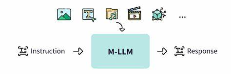

# Multimodalidad en Modelos de Lenguaje Grandes (Feb. 2025)

  

Este repositorio recopila **dos recursos fundamentales**, desarrollados como parte de un ejercicio práctico y teórico, en el que se explora el estado del arte de la _multimodalidad aplicada a modelos de lenguaje grandes_. Estos recursos sientan las bases para su ampliación y desarrollo en futuras iteraciones, contando con más tiempo y mayores recursos:

- **[Multimodality in Large Language Models](./Multimodality%20in%20Large%20Language%20Models.md):**  
  Documento de investigación que presenta una revisión exhaustiva sobre la multimodalidad en MLLMs hasta febrero de 2025. Con un corpus de 50-75 documentos, en él se analizan _avances, tendencias, desafíos, benchmarks_ y se incluyen referencias de gran rigor técnico. *([Con copia en Inglés para subirlo a arXiv](./Summary%20for%20arXiv.pdf))*

- **[Benchmark MLLM](./Benchmark%20MLLM.ipynb):**  
  Notebook Jupyter que complementa la investigación con _análisis prácticos, código y visualizaciones_. Este ejercicio teórico permite experimentar y reproducir algunos de los conceptos expuestos, sirviendo como _plataforma base para desarrollos futuros_.

## Contenido

- **Introducción y Contexto:**  
  _Visión general_ sobre la evolución y relevancia de la multimodalidad en sistemas de lenguaje actuales.

- **Definición, Objetivos y Metodología:**  
  _Descripción de los objetivos específicos_ de la investigación y el enfoque utilizado para la recopilación y análisis de información.

- **Estado del Arte y Benchmarks:**  
  Revisión de los principales modelos y técnicas, incluyendo _análisis comparativos y evaluaciones_ basadas en benchmarks reconocidos.

- **Costes Computacionales y Desafíos:**  
  _Discusión sobre las demandas de recursos_, limitaciones y estrategias para mitigar los costes computacionales en modelos multimodales.

- **Implementaciones y Ecosistema Open-Source:**  
  _Exploración de las herramientas y recursos disponibles_ en la comunidad, destacando el auge del código abierto en este campo.

- **Conclusiones y Perspectivas Futuras:**  
  Reflexiones sobre el ejercicio realizado y _proyecciones hacia desarrollos futuros_ con mayor cantidad de recursos y mejoras continuas.

## Aviso Importante
Ambos archivos se tratan de ejercicios teóricos realizados como parte de una práctica. Este material sienta las bases para futuras iteraciones en las que se integrarán más recursos y se profundizará en el desarrollo de aplicaciones prácticas en el ámbito de la multimodalidad en modelos de lenguaje.

## Licencia

Este proyecto se distribuye bajo MIT License.

_Elaborado por [Pedro Ismael Ruiz](https://www.linkedin.com/in/pdro-ruiz/) – 03/03/2025._
